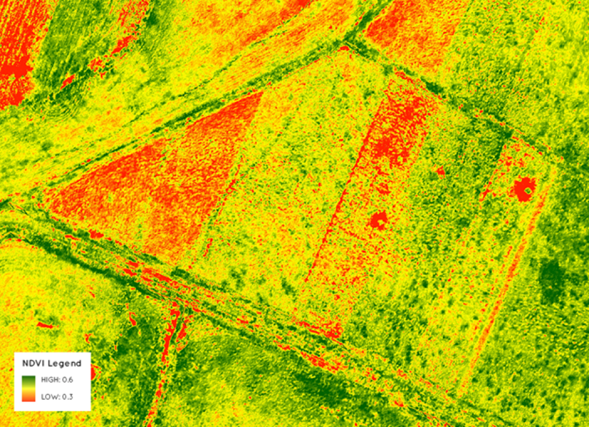

# Sentinel-2 Overview

## Summary
- Launched by ESA under the Copernicus programme
- High-resolution optical imagery (10–60 m)
- Frequent global coverage (~5-day revisit with multiple satellites)

---

## Sensor Features
- Multispectral sensors with 13 bands (visible, NIR, SWIR)
- Supports flood mapping, vegetation monitoring, and coastal tracking

---

## Applications
- Agricultural monitoring (NDVI and crop health)
- Disaster mapping (floods, fires)
- Urban land cover classification

---

## Example: Vegetation
- An example of using NDVI, as mentioned previously, to monitor vegetation growth and health

---

## Example: Flood Detection
- Uses shortwave infrared bands to map water
- Useful in cloudy conditions during flooding events

---

## Limitations
- Cloud cover interferes with optical imagery
- Spatial resolution not sufficient for street-level detail

---

## Reflection
- I learned how widely applicable Sentinel-2 is—from farms to coasts
- It helps me see how remote sensing supports environmental and urban policy

